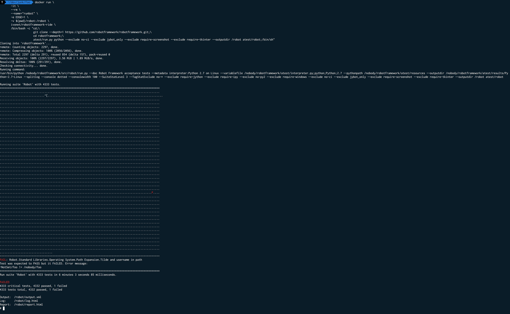

# Robotframework Ride IDE 

Run the Robotframework Ride IDE X app accessible in a web browser

## Install

On platforms like macOS, Ubuntu Synology 6.0 DSM, etc you can start with a command like:

```bash
docker run \
       -d \
       --rm \
       --name="robot" \
       -e WIDTH="1280" \
       -e HEIGHT="720" \
       -v $(pwd)/config:/config:rw \
       -v $(pwd)/robot:/robot \
       -p XXXX:8080 \
        jmcn/robotframework-ride-web
```

Syntax:

```bash
docker run [docker options] ivonet/robotframework-ride[:version] [image options]
```

### Setup Instructions
- Replace the variable "$(pwd)/config" with your choice of folder on your system. That is where the config and the library files will reside, and they will survive an update, re installation, etc. of the container.
- Replace the variable "$(pwd)/robot" with your choice of folder where you can store your testcases locally on your system. That is where the config and the library files will reside, and they will survive an update, re installation, etc. of the container.
- Change "XXXX" to a port of your choice, it will be the port for the main Ride GUI
- If you'd like to change the resolution for the GUI, you can modify the WIDTH and HEIGHT variables

You can access the GUI by pointing your web browser to http://SERVERIP:XXXX/#/client/c/Ride

Or by going to http://SERVERIP:XXXX and selecting Ride in the gui.

Replace SERVERIP, XXXX with your values. 
SERVERIP is mostly localhost on docker native and `docker-machine ip default` if still with virtualbox


## Commandline Options

### Environment

* `EDGE=[0|1]` -> 0 no auto update, 1 auto update
* `WIDTH` -> default 1280
* `HEIGHT` -> default 720

### Volumes

* `/robot` -> map to local folder and safe your testcases here
* `/config` -> map to local folder if you want the config t survive image updates

### Port

* map local port to 8080 on vm to get access to the web interface from local machine

## Examples

### Example 1 - Daemon mode Ride IDE in browser

```bash
docker run \ 
      -d \
      --rm \
      --name="ride" \
      -v $(pwd)/config:/config:rw \
      -v $(pwd)/robot:/robot \
      -p 8080:8080 \
      jmcn/robotframework-ride-web
```

* Runs the Robotframework Ride IDE in deamon mode with the config in the current folder/config and test files in the current folder/robot dir.
* Runs on port 8080
* The image is called ride during run phase
* When stopped the named (ride) image is removed. 
* [Show in browser](http://localhost:8080) (assuming that you run docker native)

### Example 2 - Interactive shell mode

```bash
docker run \
       -it \
       --rm \
       --name "robot" \
       -v $(pwd):/mnt \
       -v $(pwd)/robot:/robot \
       -p 8888:8080 \
        jmcn/robotframework-ride-web /bin/sh
```

* runs in interactive mode 
* image is called robot
* port 8888 is mapped to 8080 in vm
* mounts the current folder on virtual machine /mnt folder
* enters the shell 
* you can access play around with the system to try stuff out through the commandline
* the image will be removed after stopping the instance
* command `/sbin/my_init` with start the gui server
* [Show in browser](http://localhost:8888) (assuming that you run docker native and you ran the gui server)

### Example 3 - Daemon mode with auto update

```bash
docker run \
       -d \
       --name="ride" \
       -e EDGE=1 \
       -v $(pwd)/config:/config:rw \
       -v $(pwd)/robot:/robot \
       -p 8080:8080 \
       jmcn/robotframework-ride-web:1.0.0
```
* runs image version 1.0.0 
* auto update enabled by setting the EDGE variable to 1 (default 0)
* named image will remain after stop (you can start it again with `docker start ride`)
* rest same as example 1

### Example 4 - Interactive mode with auto update

```bash
docker run \ 
       -it \
       --name="ride" \
       -e EDGE=1 \
       -v $(pwd)/config:/config:rw \
       -v $(pwd)/robot:/robot \
       -p 8080:8080 \
        jmcn/robotframework-ride-web:latest
```
* auto update enabled by setting the EDGE variable to 1 (default 0)
* named image will remain after stop (you can start it again with `docker start ride`)
* interactive mode
* rest same as example 1

### Example 5 - Run multiple commands in interactive mode

```bash
docker run \
       -it \
       --rm \
       --name="runbot" \
       -e EDGE=1 \
       -v $(pwd)/robot:/robot \
       jmcn/robotframework-ride-web \
       /bin/bash -c "cd;\
                     git clone --depth=1 https://github.com/robotframework/robotframework.git;\
                     cd robotframework;\
                     atest/run.py python --exclude no-ci --exclude jybot_only --exclude require-screenshot --exclude require-tkinter --outputdir /robot atest/robot"  
```
* run the ride image in interactive mode
* remove named image when stopped when stopped
* auto update
* map `./robot` to the test folder
* run the following commands:
    * `cd` -> goto home dir
    * `git clone --depth=1 https://github.com/robotframework/robotframework.git` -> Clone the robotframework into the homedir
    * `cd robotframework` go into the cloned repo
    *  `atest/run.py python --exclude no-ci --exclude jybot_only --exclude require-screenshot --exclude require-tkinter --outputdir /robot atest/robot` -> run the acceptance tests and report the results to the mapped /robot dir
* quit after run
* add `;/bin/sh` to the last command to not exit but enter the shell after run

## ToDo

* pip install robotframework-sshlibrary -> Fails to build


## Screenshots

### Entre Screen


### Ride in browser


### Output of Example 5

